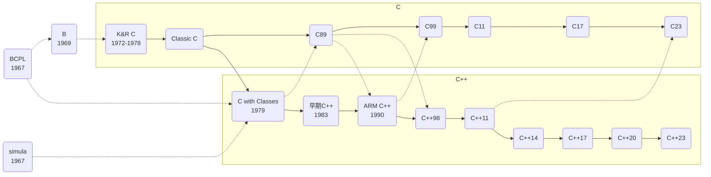

#### C++的历史

```mermaid
flowchart LR

subgraph C
KnRC(K&R C<br>1972-1978) --> ClassicC(Classic C)
ClassicC --> C89(C89)
C89 --> C99(C99)
C99 --> C11(C11)
C11 ---> C17(C17)
C17 ---> C23(C23)
end

subgraph C++
CWC(C with Classes<br>1979) --> EarlyCpp(早期C++<br>1983)
EarlyCpp --> ARMCpp(ARM C++<br>1990)
ARMCpp --> Cpp98(C++98)
Cpp98 --> Cpp11(C++11)
Cpp11 --> Cpp14(C++14)
Cpp14 --> Cpp17(C++17)
Cpp17 --> Cpp20(C++20)
Cpp20 --> Cpp23(C++23)
end


BCPL(BCPL<br>1967) -.-> B(B<br>1969) -.-> KnRC
Simula(simula<br>1967) -....-> CWC

CWC -.-> C89
ClassicC --> CWC
BCPL -.-> CWC
C89 -.-> ARMCpp
C89 -.-> Cpp98
ARMCpp -.-> C99
Cpp11 -.-> C23
```
